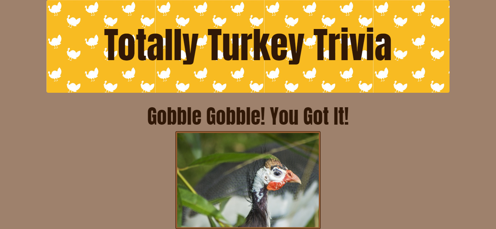

# Turkey Trivia Game 🍗
A fun and interactive trivia game for web browsers. This app dynamically updates the HTML pages with the jQuery library.


## Functionality 💪
#### Here's how the app works: 

* In this trivia game, only one question appears until the player answers it or their time runs out.

```
countdown: function() {
    game.counter--;
    $("#counter").html(game.counter);

    if (game.counter<=0) {
        console.log("Time's UP!!");
        game.timeUp();
    };
},

showQuestion: function() {
    timer = setInterval(game.countdown, 1000);
    $("#contentWrap").html("<h3>TIME: <span id = 'counter'>20</span> Seconds</h3>");
    $("#contentWrap").append('<h2>' + questions[game.currentQuestion].question + '</h2>');

    for (var i=0; i<questions[game.currentQuestion].answers.length; i++) {
        // console.log(`answers${i}`, questions[game.currentQuestion].answers[i]);
        
        $('#contentWrap').append('<button class="answer-button" id="button- '+ i +' "data-name="' +questions[game.currentQuestion].answers[i] + '">' + questions[game.currentQuestion].answers[i] + '</button>');
    }
},
```
* If the player selects the correct answer, they receive a congratulatory message. 

* After a few seconds, without user input, the next question appears.

* Similarly, the player receives a message and a turkey sound when the answer is incorrect or time runs out.  The correct answer displays. Without user input, the next question appears after a few seconds.

```
incorrectAnswer: function() {
    // console.log("negative, ghost-rider");
    clearInterval(timer);
    game.incorrect++;
    $("#contentWrap").html('<h2>Study up, little turkey!</h2>');
    $('#contentWrap').append('<h3>The correct answer was: '+questions[game.currentQuestion].correctAnswer+'</h3>');

    var audioIncorrect = document.createElement("audio");
    audioIncorrect.setAttribute("src", "assets/sounds/correctSound.mp3");
    audioIncorrect.play();


    var img = $('').attr('src', questions[game.currentQuestion].image).attr('alt', "A picture of a turkey.").addClass("button img-thumbnail");

    $('#contentWrap').append(img); 

    if (game.currentQuestion==questions.length-1) {
        setTimeout(game.results,3*1000);
    }else {
        setTimeout(game.nextQuestion,3*1000);
    }
},
```

* On the final screen, the number of correct, incorrect, and unanswered questions is displayed, along with the option to play again.

## Getting Started 🏁

These instructions will get you a copy of the project up and running on your local machine for grading and testing purposes. 

1. clone repository. 
2. open repository in your IDE of choice.
3. view `app.js` for logic.
4. view `index.html` for the document.
5. view `style.css` for the style.
6. open `index.html` in browser of choice to demo the application locally.


## Built With 🔧

* [Bootstrap](https://getbootstrap.com/) - css framework used.
* [JQuery](https://cdnjs.cloudflare.com/ajax/libs/jquery/3.2.1/jquery.min.js) - JavaScript library used.


## Authors ⌨️

* **Genevieve DePriest** - [gdepriest](https://github.com/gdepriest)

## Acknowledgments 🌟

* Amber Burroughs, Tutoring badass
* Lindsey, TA goddess
* Grace, TA goddess
* Sarah Cullen, Maestro
